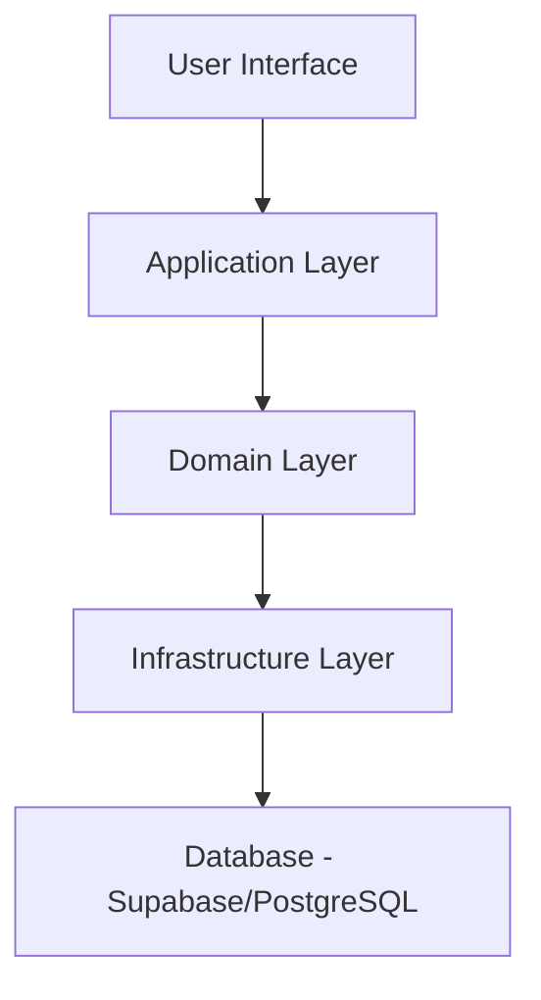
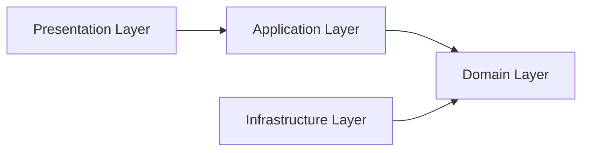

# System Architecture

This document explains the technical architecture, design patterns, and implementation details of the UCC Control de Acceso system.

## High-Level Architecture

The system follows a **Clean Architecture** approach with clear separation between layers:



## Technology Stack

<CardGroup cols={2}>
  <Card title="Frontend" icon="react">
    - React 18 (Functional Components + Hooks)
    - Vite (Build Tool)
    - Tailwind CSS (Styling)
    - React Router DOM (Navigation)
  </Card>
  <Card title="Backend/Database" icon="database">
    - Supabase (PostgreSQL)
    - Row-Level Security (RLS)
    - Database Triggers
    - Stored Procedures
  </Card>
  <Card title="Architecture" icon="layer-group">
    - Clean Architecture
    - Repository Pattern
    - Use Cases (Domain Logic)
    - Custom React Hooks
  </Card>
  <Card title="DevOps" icon="code-branch">
    - Git Version Control
    - Environment Variables
    - Modular Structure
    - Progressive Web App (PWA)
  </Card>
</CardGroup>

## Frontend Architecture

The frontend follows **Clean Architecture** principles with clear layer separation:

### Layer Structure

```
src/
├── modules/
│   ├── login/
│   │   ├── domain/              # Business logic (pure)
│   │   │   ├── entities/        # User, Role entities
│   │   │   ├── repositories/    # Repository interfaces
│   │   │   └── usecases/        # Business rules
│   │   ├── infrastructure/      # External dependencies
│   │   │   ├── api/            # HTTP client
│   │   │   └── repositories/   # API implementations
│   │   ├── application/         # Application logic
│   │   │   └── hooks/          # Custom React hooks
│   │   └── presentation/        # UI layer
│   │       ├── components/     # React components
│   │       └── pages/          # Page views
│   ├── user-profile/
│   └── admin/
└── shared/                   # Shared utilities
```

### Dependency Flow

<Info>
  Dependencies flow **inward**: Presentation → Application → Domain ← Infrastructure
  
  The Domain layer has **no dependencies** on external frameworks or libraries.
</Info>



### Example: Login Flow

<Steps>
  <Step title="User Enters ID">
    `LoginPage.jsx` receives institutional ID from user input
  </Step>
  <Step title="Hook Processes Input">
    `useLogin` hook validates and calls use case
  </Step>
  <Step title="Use Case Executes">
    `ValidateInstitutionalIdUseCase` applies business rules
  </Step>
  <Step title="Repository Fetches Data">
    `AuthRepositoryImpl` queries Supabase database
  </Step>
  <Step title="Response Returns">
    Data flows back through layers to UI
  </Step>
</Steps>

## Database Architecture

The database uses **PostgreSQL** (via Supabase) with a normalized schema design.

### Entity-Relationship Diagram

```dbml
Table usuarios {
  id bigint [pk, increment]
  id_institucional varchar [unique]
  documento_identidad varchar [unique]
  nombre_completo varchar
  acceso estado_de_acceso [default: 'activo']
  total_fallas int [default: 0]
}

Table roles {
  id bigint [pk, increment]
  nombre_rol varchar [unique]
  descripcion text
}

Table usuario_roles {
  id bigint [pk, increment]
  id_institucional varchar [ref: > usuarios.id_institucional]
  rol_id bigint [ref: > roles.id]
}

Table info_estudiante {
  id bigint [pk, increment]
  id_institucional varchar [ref: - usuarios.id_institucional]
  programa varchar
}

Table info_empleado {
  id bigint [pk, increment]
  id_institucional varchar [ref: - usuarios.id_institucional]
  cargo varchar
  dependencia varchar
}

Table info_contratista {
  id bigint [pk, increment]
  id_institucional varchar [ref: - usuarios.id_institucional]
  empresa varchar
}

Table fallas {
  id bigint [pk, increment]
  id_institucional varchar [ref: > usuarios.id_institucional]
  fecha_hora timestamptz
  motivo varchar [note: 'olvido | perdida']
}

Table semestres {
  id bigint [pk, increment]
  nombre text
  fecha_inicio date
  fecha_fin date
  activo boolean
}
```

### Key Design Decisions

<AccordionGroup>
  <Accordion title="Why id_institucional as Foreign Key?">
    The `usuario_roles` and role-specific info tables use `id_institucional` (VARCHAR) instead of the internal `id` (BIGINT) because:

    - **Stability**: `id_institucional` never changes between semesters
    - **Internal ID changes**: The `id` resets when database is cleaned
    - **CSV Import**: Allows direct CSV upload without ID lookups
    
    ```sql
    -- CSV file can directly reference id_institucional
    id_institucional,programa
    80123456,Ingeniería de Sistemas
    80123457,Derecho
    ```

    This eliminates intermediate steps during semester transitions.
  </Accordion>

  <Accordion title="Multi-Role Implementation">
    Users can have multiple roles simultaneously (e.g., Student + Employee):

    ```sql
    -- User 80123456 is both student and employee
    INSERT INTO info_estudiante VALUES (1, '80123456', 'Derecho');
    INSERT INTO info_empleado VALUES (1, '80123456', 'Asistente', 'Tesorería');
    ```

    The `usuario_roles` junction table maintains this many-to-many relationship.
  </Accordion>

  <Accordion title="Separate Role Information Tables">
    Instead of one table with nullable columns, we use separate tables:

    **Why?**
    - Cleaner schema (no nullable columns)
    - Easier CSV imports (one file per role type)
    - Better performance (smaller tables, targeted indexes)
    - Simplified queries (no complex CASE statements)

    ```sql
    -- Good: Separate tables
    SELECT * FROM info_estudiante WHERE id_institucional = '80123456';
    
    -- Bad: Single table with nulls
    SELECT * FROM info_usuarios 
    WHERE id_institucional = '80123456' 
    AND programa IS NOT NULL;
    ```
  </Accordion>

  <Accordion title="Minimal Data Storage">
    Role-specific tables store **only essential information**:

    - **Students**: Program only (no grades, financial info)
    - **Employees**: Job title and department (no salary, contracts)
    - **Contractors**: Company only (no contract details, rates)

    **Rationale**: Minimize sensitive data exposure while providing enough context for security personnel.
  </Accordion>
</AccordionGroup>

## Business Logic Automation

The system uses **database triggers** to enforce business rules automatically.

### Automatic Role Assignment

```sql
-- File: 06_triggers_roles.sql
CREATE TRIGGER trg_info_estudiante_insert
  AFTER INSERT ON info_estudiante
  FOR EACH ROW
  EXECUTE FUNCTION fn_asignar_rol_estudiante();
```

<Tabs>
  <Tab title="Student Role">
    When a row is inserted into `info_estudiante`:
    1. Trigger fires: `trg_info_estudiante_insert`
    2. Function executes: `fn_asignar_rol_estudiante()`
    3. Row inserted into `usuario_roles` with `rol_id = 1` (Estudiante)

    **Revocation**: When deleted from `info_estudiante`, role is automatically removed.
  </Tab>

  <Tab title="Employee Role">
    When a row is inserted into `info_empleado`:
    1. Trigger fires: `trg_info_empleado_insert`
    2. Function executes: `fn_asignar_rol_empleado()`
    3. Row inserted into `usuario_roles` with `rol_id = 2` (Empleado)
  </Tab>

  <Tab title="Contractor Role">
    When a row is inserted into `info_contratista`:
    1. Trigger fires: `trg_info_contratista_insert`
    2. Function executes: `fn_asignar_rol_contratista()`
    3. Row inserted into `usuario_roles` with `rol_id = 3` (Contratista)
  </Tab>
</Tabs>

### Automatic Failure Tracking and Blocking

```sql
-- File: 07_fallas.sql
CREATE TRIGGER trg_fallas_insert
  AFTER INSERT ON fallas
  FOR EACH ROW
  EXECUTE FUNCTION fn_actualizar_fallas();
```

**What it does**:

<Steps>
  <Step title="Count Failures">
    Counts total `olvido` failures for the user:
    ```sql
    SELECT COUNT(*) FROM fallas WHERE id_institucional = '80123456';
    ```
  </Step>

  <Step title="Update Counter">
    Updates `total_fallas` in `usuarios` table
  </Step>

  <Step title="Auto-Block at 4">
    If `total_fallas >= 4`, automatically sets `acceso = 'bloqueado'`
    ```sql
    UPDATE usuarios 
    SET acceso = CASE WHEN v_total >= 4 THEN 'bloqueado' ELSE acceso END
    WHERE id_institucional = '80123456';
    ```
  </Step>
</Steps>

<Warning>
  The trigger fires on **both INSERT and DELETE**, so if an admin corrects a failure record, the count is recalculated automatically.
</Warning>

## Security Architecture

### Row-Level Security (RLS)

All tables have **Row-Level Security** enabled:

```sql
-- File: 08_rls_policies.sql
ALTER TABLE usuarios ENABLE ROW LEVEL SECURITY;

CREATE POLICY "lectura pública usuarios" 
  ON usuarios FOR SELECT 
  USING (true);
```

<Tabs>
  <Tab title="Read Policies">
    **Public Read Access**:
    - `usuarios`: All users can read (for login validation)
    - `roles`: Public catalog
    - `info_estudiante`, `info_empleado`, `info_contratista`: Public read
    - `fallas`: Users can see their own failures

    ```sql
    CREATE POLICY "lectura propia fallas" ON fallas
      FOR SELECT USING (true);
    ```
  </Tab>

  <Tab title="Write Policies">
    **Restricted Write Access**:
    - `fallas`: Anyone can insert (for self-service kiosks)
    - `usuarios`: No direct writes (managed by admin interface)
    - Role-specific tables: Controlled by admin functions

    ```sql
    CREATE POLICY "insertar falla" ON fallas
      FOR INSERT WITH CHECK (true);
    ```
  </Tab>

  <Tab title="Admin Policies">
    **Future Enhancement**: Admin-specific policies will use Supabase Auth:

    ```sql
    CREATE POLICY "admin actualizar usuario" ON usuarios
      FOR UPDATE 
      USING (auth.jwt() ->> 'role' = 'admin')
      WITH CHECK (auth.jwt() ->> 'role' = 'admin');
    ```
  </Tab>
</Tabs>

### Data Validation

Multi-layer validation ensures data integrity:

<CardGroup cols={3}>
  <Card title="Database Level" icon="database">
    - CHECK constraints
    - UNIQUE constraints
    - Foreign key constraints
    - NOT NULL constraints
  </Card>
  <Card title="Trigger Level" icon="bolt">
    - Business rule enforcement
    - Automatic calculations
    - Relationship maintenance
  </Card>
  <Card title="Application Level" icon="shield">
    - Input sanitization
    - Format validation
    - Use case rules
  </Card>
</CardGroup>

## State Management

The frontend uses **React hooks** for state management:

### Custom Hooks Pattern

```jsx
// File: src/modules/login/application/hooks/useLogin.js
export const useLogin = () => {
  const [loading, setLoading] = useState(false);
  const [error, setError] = useState(null);
  
  const validateId = async (institutionalId) => {
    setLoading(true);
    try {
      const useCase = new ValidateInstitutionalIdUseCase(repository);
      const user = await useCase.execute(institutionalId);
      return user;
    } catch (err) {
      setError(err.message);
    } finally {
      setLoading(false);
    }
  };
  
  return { validateId, loading, error };
};
```

**Benefits**:
- Reusable logic across components
- Separation of concerns
- Easy testing
- Clean component code

## API Communication

### Supabase Client

The system uses the Supabase JavaScript client:

```javascript
// File: src/shared/infrastructure/supabase/supabaseClient.js
import { createClient } from '@supabase/supabase-js';

export const supabase = createClient(
  import.meta.env.VITE_SUPABASE_URL,
  import.meta.env.VITE_SUPABASE_ANON_KEY
);
```

### Repository Pattern

All database access goes through repositories:

```javascript
// File: src/modules/login/infrastructure/repositories/AuthRepositoryImpl.js
export class AuthRepositoryImpl {
  async findByInstitutionalId(id) {
    const { data, error } = await supabase
      .from('usuarios')
      .select(`
        *,
        usuario_roles(
          rol_id,
          roles(nombre_rol)
        )
      `)
      .eq('id_institucional', id)
      .single();
    
    if (error) throw new Error(error.message);
    return data;
  }
}
```

## Performance Optimizations

<AccordionGroup>
  <Accordion title="Database Indexes">
    Strategic indexes on frequently queried columns:

    ```sql
    CREATE INDEX idx_usuarios_id_institucional ON usuarios (id_institucional);
    CREATE INDEX idx_fallas_id_inst ON fallas (id_institucional);
    CREATE INDEX idx_fallas_fecha_hora ON fallas (fecha_hora DESC);
    ```
  </Accordion>

  <Accordion title="Query Optimization">
    Use Supabase's query builder for efficient joins:

    ```javascript
    // Single query with nested relations
    const { data } = await supabase
      .from('usuarios')
      .select(`
        *,
        usuario_roles(roles(nombre_rol)),
        info_estudiante(programa),
        info_empleado(cargo, dependencia)
      `);
    ```
  </Accordion>

  <Accordion title="Frontend Optimization">
    - Code splitting with dynamic imports
    - Lazy loading of routes
    - Memoization of expensive computations
    - Debouncing of search inputs
  </Accordion>
</AccordionGroup>

## Scalability Considerations

<CardGroup cols={2}>
  <Card title="Database Scaling" icon="database">
    - Supabase auto-scales with usage
    - Connection pooling built-in
    - Read replicas available on higher tiers
    - Periodic data archival (semester cleanup)
  </Card>
  <Card title="Frontend Scaling" icon="server">
    - Static site generation possible
    - CDN-friendly architecture
    - Serverless deployment ready
    - Progressive Web App (offline capable)
  </Card>
</CardGroup>

## Error Handling

Comprehensive error handling at every layer:

<Steps>
  <Step title="Database Level">
    - Constraint violations return specific errors
    - Triggers can raise exceptions
    - Transaction rollback on failure
  </Step>

  <Step title="Repository Level">
    - Supabase errors caught and wrapped
    - Custom error types for domain errors
    - Detailed error messages for debugging
  </Step>

  <Step title="Use Case Level">
    - Business rule violations throw domain errors
    - Validation errors with user-friendly messages
    - Logging of important errors
  </Step>

  <Step title="Presentation Level">
    - User-friendly error display
    - Error boundaries for React crashes
    - Retry mechanisms for transient failures
  </Step>
</Steps>

## Next Steps

<CardGroup cols={2}>
  <Card title="Explore Features" icon="star" href="/features/user-authentication">
    Learn about specific features
  </Card>
  <Card title="User Flows" icon="users" href="/user-guide/student-flow">
    Understand user workflows
  </Card>
  <Card title="Admin Guide" icon="gauge" href="/admin/overview">
    Configure and manage the system
  </Card>
  <Card title="Database Schema" icon="table" href="/admin/semester-management">
    Deep dive into database design
  </Card>
</CardGroup>
