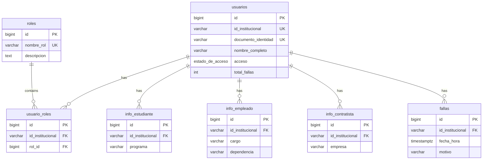

## System Overview

The UCC Access Control System uses **PostgreSQL** (via Supabase) to manage user identification, role-based access, and failure tracking. The database is designed for simplicity, security, and automated role management.

## Architecture Principles

<CardGroup cols={2}>
  <Card title="Minimal Data" icon="shield-halved">
    Only essential information for access control is stored. No sensitive academic or contractual data.
  </Card>
  <Card title="Automated Roles" icon="arrows-rotate">
    Triggers automatically assign/revoke roles when information tables are updated.
  </Card>
  <Card title="Multi-Role Support" icon="users">
    Users can have multiple roles simultaneously (e.g., Student + Employee).
  </Card>
  <Card title="CSV-Driven Updates" icon="file-csv">
    Data is loaded directly from CSV files without manual role management.
  </Card>
</CardGroup>

## Database Schema



## Core Tables

### Primary Tables

<AccordionGroup>
  <Accordion title="usuarios - Main user registry">
    Central table containing basic user identification and access status.
    
    **Key Features:**
    - Unique institutional ID and national ID
    - Access state: `activo` or `bloqueado`
    - Failure counter (max 4 before automatic block)
  </Accordion>
  
  <Accordion title="roles - Role catalog">
    Fixed catalog of available roles:
    - Estudiante (Student)
    - Empleado (Employee)
    - Contratista (Contractor)
    
    **Note:** This table is pre-populated and not modified during semester operations.
  </Accordion>
  
  <Accordion title="usuario_roles - User-Role mapping">
    Many-to-many relationship between users and roles.
    
    **Design Decision:** Uses `id_institucional` (not internal `id`) to enable direct CSV loading without intermediate steps.
  </Accordion>
</AccordionGroup>

### Information Tables

<AccordionGroup>
  <Accordion title="info_estudiante - Student information">
    Stores only the academic program name.
    
    **Trigger:** Automatically assigns/revokes "Estudiante" role on INSERT/DELETE.
  </Accordion>
  
  <Accordion title="info_empleado - Employee information">
    Stores job title and department.
    
    **Trigger:** Automatically assigns/revokes "Empleado" role on INSERT/DELETE.
  </Accordion>
  
  <Accordion title="info_contratista - Contractor information">
    Stores company name.
    
    **Trigger:** Automatically assigns/revokes "Contratista" role on INSERT/DELETE.
  </Accordion>
</AccordionGroup>

### Transaction Tables

<Accordion title="fallas - Failure tracking">
  Records incidents when users don't have their TIC (Institutional ID Card).
  
  **Automatic Actions:**
  - Recalculates `total_fallas` in `usuarios`
  - Blocks access when count reaches 4
  - Supports both "olvido" (forgot) and "perdida" (lost) reasons
</Accordion>

<Accordion title="semestres - Academic semesters">
  Manages active academic period with name and date range.
  
  **Constraint:** Only one semester can be active at a time.
</Accordion>

## Key Design Decisions

### Why `id_institucional` Instead of Internal `id`?

<Note>
  The `usuario_roles` table uses `id_institucional` (VARCHAR) as the foreign key instead of the internal `id` (BIGINT).
</Note>

**Rationale:**
- `id_institucional` is **stable** across semesters (doesn't change)
- Internal `id` changes when database is cleaned
- Enables **independent CSV loading** of users and roles
- No intermediate steps or ID lookups required

### Multi-Role Support

<Info>
  A user can have multiple roles simultaneously. Example:
  - User 80100003: Student AND Employee
  - User 80100006: Contractor AND Employee
</Info>

The system creates separate rows in `usuario_roles` for each role. The `UNIQUE (id_institucional, rol_id)` constraint prevents duplicates.

### Automatic Role Management

<Warning>
  **Never** use `TRUNCATE` to clear information tables. Use `DELETE FROM` instead.
</Warning>

`TRUNCATE` does not fire row-level triggers, which means roles would never be revoked. Always use:

```sql
DELETE FROM info_estudiante;
INSERT INTO info_estudiante (id_institucional, programa) VALUES (...);
```

## Row Level Security (RLS)

All tables have RLS enabled with public policies for frontend access using Supabase's anon key.

<CardGroup cols={2}>
  <Card title="SELECT" icon="eye">
    All tables allow public read access
  </Card>
  <Card title="INSERT" icon="plus">
    Enabled for data loading operations
  </Card>
  <Card title="UPDATE" icon="pen">
    Enabled where needed (usuarios, info_* tables)
  </Card>
  <Card title="DELETE" icon="trash">
    Enabled for semester cleanup operations
  </Card>
</CardGroup>

## Data Flow

<Steps>
  <Step title="CSV Upload">
    Admin uploads CSV files for students, employees, or contractors
  </Step>
  
  <Step title="Data Insertion">
    Records are inserted into `usuarios` and corresponding `info_*` tables
  </Step>
  
  <Step title="Trigger Execution">
    Database triggers automatically insert records into `usuario_roles`
  </Step>
  
  <Step title="Role Assignment Complete">
    Users now have appropriate roles without manual intervention
  </Step>
</Steps>

## Next Steps

<CardGroup cols={2}>
  <Card title="View Tables" icon="table" href="/database/tables">
    Detailed table schemas and column definitions
  </Card>
  <Card title="Relationships" icon="diagram-project" href="/database/relationships">
    Foreign keys and table relationships
  </Card>
  <Card title="Triggers" icon="bolt" href="/database/triggers">
    Automated triggers and stored procedures
  </Card>
  <Card title="Setup" icon="rocket" href="/database/installation">
    Database installation instructions
  </Card>
</CardGroup>