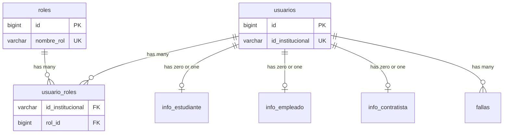

## Entity Relationship Overview

The database uses a hub-and-spoke model with `usuarios` at the center.



## Primary Relationships

### usuarios → usuario_roles (One-to-Many)

<Note>
  A user can have multiple roles simultaneously.
</Note>

**Foreign Key:**
```sql
REFERENCES usuarios(id_institucional) ON DELETE CASCADE
```

**Characteristics:**
- Uses `id_institucional` (VARCHAR) instead of `id` (BIGINT)
- Enables direct CSV loading without ID lookups
- CASCADE delete: removing a user removes all their role assignments

**Example Data:**
```sql
-- User 80100003 has TWO roles
INSERT INTO usuario_roles (id_institucional, rol_id) VALUES
  ('80100003', 1),  -- Estudiante
  ('80100003', 2);  -- Empleado
```

---

### roles → usuario_roles (One-to-Many)

**Foreign Key:**
```sql
REFERENCES roles(id)
```

**Characteristics:**
- Many users can have the same role
- No cascade delete (roles are fixed catalog)

---

### usuarios → info_estudiante (One-to-Zero-or-One)

<Info>
  Only users with the "Estudiante" role have a record in this table.
</Info>

**Foreign Key:**
```sql
REFERENCES usuarios(id_institucional) ON DELETE CASCADE
```

**Characteristics:**
- `id_institucional` must be UNIQUE in `info_estudiante`
- INSERT triggers automatic role assignment
- DELETE triggers automatic role revocation
- CASCADE delete: removing a user removes their student info

**Verification Query:**
```sql
-- Check students with their roles
SELECT 
    u.id_institucional,
    u.nombre_completo,
    ie.programa,
    r.nombre_rol
FROM usuarios u
INNER JOIN info_estudiante ie ON ie.id_institucional = u.id_institucional
LEFT JOIN usuario_roles ur ON ur.id_institucional = u.id_institucional
LEFT JOIN roles r ON r.id = ur.rol_id;
```

---

### usuarios → info_empleado (One-to-Zero-or-One)

**Foreign Key:**
```sql
REFERENCES usuarios(id_institucional) ON DELETE CASCADE
```

**Characteristics:**
- `id_institucional` must be UNIQUE in `info_empleado`
- INSERT triggers automatic role assignment
- DELETE triggers automatic role revocation
- CASCADE delete: removing a user removes their employee info

**Verification Query:**
```sql
-- Check employees with their roles
SELECT 
    u.id_institucional,
    u.nombre_completo,
    em.cargo,
    em.dependencia,
    r.nombre_rol
FROM usuarios u
INNER JOIN info_empleado em ON em.id_institucional = u.id_institucional
LEFT JOIN usuario_roles ur ON ur.id_institucional = u.id_institucional
LEFT JOIN roles r ON r.id = ur.rol_id;
```

---

### usuarios → info_contratista (One-to-Zero-or-One)

**Foreign Key:**
```sql
REFERENCES usuarios(id_institucional) ON DELETE CASCADE
```

**Characteristics:**
- `id_institucional` must be UNIQUE in `info_contratista`
- INSERT triggers automatic role assignment
- DELETE triggers automatic role revocation
- CASCADE delete: removing a user removes their contractor info

**Verification Query:**
```sql
-- Check contractors with their roles
SELECT 
    u.id_institucional,
    u.nombre_completo,
    ic.empresa,
    r.nombre_rol
FROM usuarios u
INNER JOIN info_contratista ic ON ic.id_institucional = u.id_institucional
LEFT JOIN usuario_roles ur ON ur.id_institucional = u.id_institucional
LEFT JOIN roles r ON r.id = ur.rol_id;
```

---

### usuarios → fallas (One-to-Many)

**Foreign Key:**
```sql
REFERENCES usuarios(id_institucional) ON DELETE CASCADE
```

**Characteristics:**
- A user can have multiple failure records
- Each INSERT/DELETE triggers recalculation of `total_fallas`
- User is automatically blocked when count reaches 4
- CASCADE delete: removing a user removes all their failure records

**Automatic Blocking:**
```sql
-- Trigger updates usuarios.acceso
UPDATE usuarios
SET total_fallas = v_total,
    acceso = CASE WHEN v_total >= 4 THEN 'bloqueado' ELSE acceso END
WHERE id_institucional = v_id_inst;
```

---

## Unique Constraints

### usuarios Table

<CardGroup cols={2}>
  <Card title="id_institucional" icon="key">
    UNIQUE - Each institutional ID appears only once
  </Card>
  <Card title="documento_identidad" icon="id-card">
    UNIQUE - Each national ID appears only once
  </Card>
</CardGroup>

```sql
CREATE TABLE usuarios (
    id_institucional    VARCHAR(20) NOT NULL UNIQUE,
    documento_identidad VARCHAR(20) NOT NULL UNIQUE,
    ...
);
```

---

### usuario_roles Table

<Card title="Composite Unique Constraint" icon="link">
  Prevents duplicate role assignments for the same user
</Card>

```sql
CONSTRAINT uq_usuario_rol UNIQUE (id_institucional, rol_id)
```

**Example:**
```sql
-- This is valid (different roles)
INSERT INTO usuario_roles VALUES ('80100001', 1);  -- Estudiante
INSERT INTO usuario_roles VALUES ('80100001', 2);  -- Empleado

-- This would fail (duplicate)
INSERT INTO usuario_roles VALUES ('80100001', 1);  -- ERROR: duplicate key
```

---

### Information Tables

<AccordionGroup>
  <Accordion title="info_estudiante.id_institucional">
    UNIQUE - A user can only have one student record
    
    ```sql
    id_institucional VARCHAR(20) NOT NULL UNIQUE
    ```
  </Accordion>
  
  <Accordion title="info_empleado.id_institucional">
    UNIQUE - A user can only have one employee record
    
    ```sql
    id_institucional VARCHAR(20) NOT NULL UNIQUE
    ```
  </Accordion>
  
  <Accordion title="info_contratista.id_institucional">
    UNIQUE - A user can only have one contractor record
    
    ```sql
    id_institucional VARCHAR(20) NOT NULL UNIQUE
    ```
  </Accordion>
</AccordionGroup>

---

### semestres Table

<Card title="Unique Active Semester" icon="calendar">
  Only one semester can be active at a time
</Card>

```sql
CREATE UNIQUE INDEX semestres_activo_unico
  ON semestres (activo)
  WHERE activo = true;
```

---

## Check Constraints

### fallas.motivo

```sql
CHECK (motivo IN ('olvido', 'perdida'))
```

Ensures only valid failure reasons are recorded.

---

### semestres Date Validation

```sql
CONSTRAINT semestres_fechas_validas CHECK (fecha_fin > fecha_inicio)
```

Ensures semester end date is after start date.

---

## Cascade Behavior

<Warning>
  All foreign keys use `ON DELETE CASCADE` for automatic cleanup.
</Warning>

### What Happens When a User is Deleted?

<Steps>
  <Step title="Delete from usuarios">
    ```sql
    DELETE FROM usuarios WHERE id_institucional = '80100001';
    ```
  </Step>
  
  <Step title="Cascaded Deletions">
    PostgreSQL automatically deletes:
    - All rows in `usuario_roles` for that user
    - Row in `info_estudiante` (if exists)
    - Row in `info_empleado` (if exists)
    - Row in `info_contratista` (if exists)
    - All rows in `fallas` for that user
  </Step>
  
  <Step title="Complete Cleanup">
    No orphaned records remain in the database
  </Step>
</Steps>

---

## Multi-Role Relationships

### Example: User with Multiple Roles

```sql
-- User 80100003 is both Student and Employee

-- usuarios table
INSERT INTO usuarios (id_institucional, documento_identidad, nombre_completo)
VALUES ('80100003', '1037654323', 'Carlos Andrés Martínez Ruiz');

-- info_estudiante table
INSERT INTO info_estudiante (id_institucional, programa)
VALUES ('80100003', 'Ingeniería Industrial');
-- Trigger automatically creates: usuario_roles('80100003', 1)

-- info_empleado table
INSERT INTO info_empleado (id_institucional, cargo, dependencia)
VALUES ('80100003', 'Auxiliar Administrativo', 'Registro Académico');
-- Trigger automatically creates: usuario_roles('80100003', 2)

-- Final state in usuario_roles:
-- ('80100003', 1)  -- Estudiante
-- ('80100003', 2)  -- Empleado
```

### Query All Users with Roles

```sql
SELECT
    u.id_institucional,
    u.nombre_completo,
    STRING_AGG(r.nombre_rol, ', ' ORDER BY r.nombre_rol) AS roles,
    ie.programa,
    em.cargo,
    ic.empresa
FROM usuarios u
LEFT JOIN usuario_roles ur ON ur.id_institucional = u.id_institucional
LEFT JOIN roles r ON r.id = ur.rol_id
LEFT JOIN info_estudiante ie ON ie.id_institucional = u.id_institucional
LEFT JOIN info_empleado em ON em.id_institucional = u.id_institucional
LEFT JOIN info_contratista ic ON ic.id_institucional = u.id_institucional
GROUP BY u.id_institucional, u.nombre_completo, ie.programa, em.cargo, ic.empresa
ORDER BY u.id_institucional;
```

**Expected Output:**
```
id_institucional | nombre_completo                | roles                      | programa              | cargo                  | empresa
-----------------|--------------------------------|----------------------------|-----------------------|------------------------|----------
80100001         | Juan Diego Pérez Gómez         | Estudiante                 | Ingeniería de Sistemas| NULL                   | NULL
80100002         | María Fernanda Rodríguez López | Estudiante                 | Derecho               | NULL                   | NULL
80100003         | Carlos Andrés Martínez Ruiz    | Empleado, Estudiante       | Ingeniería Industrial | Auxiliar Administrativo| NULL
80100004         | Valentina Torres Herrera       | Contratista, Estudiante    | Administración        | NULL                   | ACME S.A.S.
```

---

## Referential Integrity

<CardGroup cols={2}>
  <Card title="Foreign Key Protection" icon="shield">
    Cannot insert into `usuario_roles` with non-existent `id_institucional`
  </Card>
  <Card title="Cascade Cleanup" icon="broom">
    Deleting a user automatically removes all related data
  </Card>
  <Card title="Unique Constraints" icon="fingerprint">
    Prevents duplicate institutional IDs and role assignments
  </Card>
  <Card title="Check Constraints" icon="circle-check">
    Validates data before insertion
  </Card>
</CardGroup>

---

## Design Benefits

<AccordionGroup>
  <Accordion title="Data Consistency">
    Foreign keys and constraints ensure data integrity at the database level.
  </Accordion>
  
  <Accordion title="Automatic Cleanup">
    CASCADE deletes prevent orphaned records when users are removed.
  </Accordion>
  
  <Accordion title="Trigger Automation">
    Roles are automatically managed based on information table changes.
  </Accordion>
  
  <Accordion title="Multi-Role Support">
    The many-to-many relationship allows flexible role assignments.
  </Accordion>
</AccordionGroup>

---

## Relationship Verification

After loading data, verify relationships are correct:

```sql
-- 1. Check for users without roles
SELECT u.id_institucional, u.nombre_completo
FROM usuarios u
LEFT JOIN usuario_roles ur ON ur.id_institucional = u.id_institucional
WHERE ur.id IS NULL;

-- 2. Check for orphaned role assignments
SELECT ur.*
FROM usuario_roles ur
LEFT JOIN usuarios u ON u.id_institucional = ur.id_institucional
WHERE u.id IS NULL;

-- 3. Check for role/info mismatches
SELECT 
    u.id_institucional,
    EXISTS(SELECT 1 FROM info_estudiante WHERE id_institucional = u.id_institucional) AS has_estudiante_info,
    EXISTS(SELECT 1 FROM usuario_roles ur JOIN roles r ON r.id = ur.rol_id WHERE ur.id_institucional = u.id_institucional AND r.nombre_rol = 'Estudiante') AS has_estudiante_role
FROM usuarios u
WHERE 
    (has_estudiante_info AND NOT has_estudiante_role) OR
    (NOT has_estudiante_info AND has_estudiante_role);
```

<Info>
  All three queries should return empty results if relationships are properly maintained.
</Info>