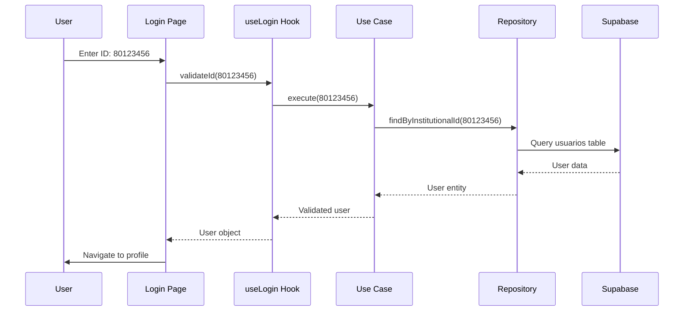

# User Authentication

The UCC Control de Acceso system uses a simple, secure **ID-based authentication** mechanism designed for quick access at campus entrances.

## Overview

Unlike traditional username/password systems, this application authenticates users solely by their **institutional ID number** (e.g., 80123456).

<Info>
  This design prioritizes **speed** and **simplicity** for security personnel who need to quickly validate users without physical ID cards.
</Info>

## How It Works

<Steps>
  <Step title="User Provides ID">
    The user or security guard enters the institutional ID number in the login screen.
    
    ```
    Input: 80123456
    ```
  </Step>

  <Step title="System Validates ID">
    The system queries the database to check if the ID exists:
    
    ```sql
    SELECT * FROM usuarios WHERE id_institucional = '80123456';
    ```
  </Step>

  <Step title="User Status Check">
    The system checks the user's access status:
    - **activo**: Proceed to show user profile
    - **bloqueado**: Display blocking message and reason
  </Step>

  <Step title="Load User Profile">
    If active, the system loads:
    - User's full name and document ID
    - All assigned roles (Student/Employee/Contractor)
    - Role-specific information
    - Current failure count
  </Step>
</Steps>

## Login Interface

The login page follows UCC's visual identity:

<Tabs>
  <Tab title="Design">
    **Visual Elements**:
    - UCC logo centered at top
    - Heading: "Ingrese su ID Institucional"
    - Large numeric input field
    - Blue "INGRESAR" button with UCC branding
    - Loading state with spinner
    - Error messages in red

    **Color Scheme**:
    - Primary: UCC Blue (#003DA5)
    - Accent: UCC Orange (#FF6B35)
    - Background: White with subtle gradient
  </Tab>

  <Tab title="Validation">
    **Input Rules**:
    - Only numeric characters allowed
    - No spaces or special characters
    - Typically 8 digits (80XXXXXX format)
    - Required field (cannot be empty)

    **Error States**:
    - "ID institucional requerido" (empty input)
    - "ID no encontrado" (ID doesn't exist in database)
    - "Error de conexión" (network/database error)
  </Tab>

  <Tab title="Implementation">
    ```jsx
    // File: src/modules/login/presentation/pages/LoginPage.jsx
    export const LoginPage = () => {
      const { validateId, loading, error } = useLogin();
      const [institutionalId, setInstitutionalId] = useState('');

      const handleSubmit = async (e) => {
        e.preventDefault();
        const user = await validateId(institutionalId);
        if (user) {
          navigate(`/user/${user.id_institucional}`);
        }
      };

      return (
        <form onSubmit={handleSubmit}>
          <input 
            type="text"
            pattern="[0-9]*"
            value={institutionalId}
            onChange={(e) => setInstitutionalId(e.target.value)}
          />
          <button disabled={loading}>INGRESAR</button>
        </form>
      );
    };
    ```
  </Tab>
</Tabs>

## Authentication Flow



## Database Query

The authentication query retrieves comprehensive user data in a single request:

```sql
SELECT 
  u.id,
  u.id_institucional,
  u.documento_identidad,
  u.nombre_completo,
  u.acceso,
  u.total_fallas,
  -- Roles
  json_agg(DISTINCT jsonb_build_object(
    'rol_id', r.id,
    'nombre_rol', r.nombre_rol
  )) as roles,
  -- Student info (if applicable)
  ie.programa,
  -- Employee info (if applicable)
  iem.cargo,
  iem.dependencia,
  -- Contractor info (if applicable)
  ic.empresa
FROM usuarios u
LEFT JOIN usuario_roles ur ON u.id_institucional = ur.id_institucional
LEFT JOIN roles r ON ur.rol_id = r.id
LEFT JOIN info_estudiante ie ON u.id_institucional = ie.id_institucional
LEFT JOIN info_empleado iem ON u.id_institucional = iem.id_institucional
LEFT JOIN info_contratista ic ON u.id_institucional = ic.id_institucional
WHERE u.id_institucional = '80123456'
GROUP BY u.id, ie.programa, iem.cargo, iem.dependencia, ic.empresa;
```

## Security Considerations

<Warning>
  **Important Security Notes**:
  - Institutional IDs are **not secret** (printed on ID cards)
  - This system assumes **physical presence** at campus entrances
  - Security personnel should verify user identity visually
  - For remote access, additional authentication would be required
</Warning>

<AccordionGroup>
  <Accordion title="Why No Password?">
    **Rationale**:
    1. **Speed**: Password entry slows down entry processing
    2. **Context**: Users are physically present and can be visually verified
    3. **Simplicity**: Reduces cognitive load for users and security staff
    4. **Forgotten Passwords**: Eliminates password reset workflows

    This is acceptable because:
    - The system only handles **contingent entry** (not normal access)
    - Physical presence provides inherent security
    - Failure records provide accountability
  </Accordion>

  <Accordion title="Row-Level Security">
    The database uses RLS policies to control data access:

    ```sql
    -- Anyone can read user data (needed for login)
    CREATE POLICY "lectura pública usuarios" 
      ON usuarios FOR SELECT 
      USING (true);

    -- But only specific roles can modify
    CREATE POLICY "admin actualizar usuarios" 
      ON usuarios FOR UPDATE 
      USING (auth.role() = 'admin');
    ```
  </Accordion>

  <Accordion title="Preventing Abuse">
    **Safeguards**:
    1. **Failure Tracking**: All entries recorded with timestamp
    2. **Automatic Blocking**: Prevents repeated abuse
    3. **Audit Trail**: Admin can review all access attempts
    4. **Physical Presence**: Security guard supervises process
  </Accordion>
</AccordionGroup>

## User Status Validation

After authentication, the system checks the user's status:

<Tabs>
  <Tab title="Active User">
    **Status**: `acceso = 'activo'`

    **System Response**:
    - Display user profile
    - Show all roles and information
    - Display current failure count: X/4
    - Enable "Registrar Ingreso" button

    ```jsx
    {user.acceso === 'activo' && (
      <>
        <UserProfile user={user} />
        <FailureCounter count={user.total_fallas} />
        <RegisterEntryButton />
      </>
    )}
    ```
  </Tab>

  <Tab title="Blocked User">
    **Status**: `acceso = 'bloqueado'`

    **System Response**:
    - Display large "USUARIO BLOQUEADO" warning
    - Show reason (4 failures / lost card / stolen card)
    - Direct user to administration office
    - Disable entry registration

    ```jsx
    {user.acceso === 'bloqueado' && (
      <BlockedUserAlert>
        <h2>USUARIO BLOQUEADO</h2>
        <p>Total de fallas: {user.total_fallas}/4</p>
        <p>Diríjase a la Dirección para desbloqueo</p>
      </BlockedUserAlert>
    )}
    ```
  </Tab>

  <Tab title="Not Found">
    **Status**: ID doesn't exist in database

    **System Response**:
    - Display "ID no encontrado" error
    - Suggest checking the ID number
    - Option to retry

    ```jsx
    {error?.type === 'NOT_FOUND' && (
      <ErrorAlert>
        <p>ID institucional no encontrado</p>
        <p>Verifique el número e intente nuevamente</p>
      </ErrorAlert>
    )}
    ```
  </Tab>
</Tabs>

## Multi-Role Handling

Users can have multiple roles simultaneously. The system displays all applicable roles:

<CodeGroup>
```sql SQL Query
-- User with multiple roles
SELECT u.nombre_completo, r.nombre_rol
FROM usuarios u
JOIN usuario_roles ur ON u.id_institucional = ur.id_institucional
JOIN roles r ON ur.rol_id = r.id
WHERE u.id_institucional = '80999999';

-- Result:
-- María López | Estudiante
-- María López | Empleado
```

```jsx React Component
// Display all roles
{user.roles.map(role => (
  <RoleBadge key={role.rol_id}>
    {role.nombre_rol === 'Estudiante' && <StudentIcon />}
    {role.nombre_rol === 'Empleado' && <EmployeeIcon />}
    {role.nombre_rol === 'Contratista' && <ContractorIcon />}
    {role.nombre_rol}
  </RoleBadge>
))}
```
</CodeGroup>

## Session Management

<Note>
  Currently, the system uses **stateless authentication**:
  - No session tokens
  - No persistent login
  - Each entry requires ID re-entry

  This is intentional for security at shared kiosks.
</Note>

### Future Enhancement: Session Support

For admin users, session management could be added:

```javascript
// Potential implementation with Supabase Auth
const { data: { session } } = await supabase.auth.signInWithPassword({
  email: admin.email,
  password: admin.password
});

// Store session token
localStorage.setItem('session', session.access_token);
```

## Error Handling

Comprehensive error handling ensures smooth user experience:

<AccordionGroup>
  <Accordion title="Network Errors">
    ```javascript
    try {
      const user = await repository.findByInstitutionalId(id);
    } catch (error) {
      if (error.code === 'NETWORK_ERROR') {
        return {
          type: 'CONNECTION_ERROR',
          message: 'Error de conexión. Verifique su internet.'
        };
      }
    }
    ```
  </Accordion>

  <Accordion title="Database Errors">
    ```javascript
    if (error.code === 'PGRST116') {
      return {
        type: 'NOT_FOUND',
        message: 'ID institucional no encontrado'
      };
    }
    ```
  </Accordion>

  <Accordion title="Validation Errors">
    ```javascript
    if (!institutionalId || institutionalId.trim() === '') {
      return {
        type: 'VALIDATION_ERROR',
        message: 'ID institucional requerido'
      };
    }
    ```
  </Accordion>
</AccordionGroup>

## Performance

The authentication system is optimized for speed:

- **Database indexes** on `id_institucional` for O(log n) lookups
- **Single query** with JOINs to load all data at once
- **Frontend caching** of static data (roles catalog)
- **Lazy loading** of large user lists in admin panel

## Testing

<Tabs>
  <Tab title="Test Active User">
    ```sql
    -- Create test user
    INSERT INTO usuarios (id_institucional, documento_identidad, nombre_completo)
    VALUES ('80TEST01', '1111111111', 'Usuario de Prueba');

    INSERT INTO info_estudiante (id_institucional, programa)
    VALUES ('80TEST01', 'Ingeniería de Pruebas');
    ```

    Test login with ID `80TEST01` - should succeed.
  </Tab>

  <Tab title="Test Blocked User">
    ```sql
    -- Create blocked user
    INSERT INTO usuarios (id_institucional, documento_identidad, nombre_completo, acceso)
    VALUES ('80BLOCK1', '2222222222', 'Usuario Bloqueado', 'bloqueado');
    ```

    Test login with ID `80BLOCK1` - should show blocked message.
  </Tab>

  <Tab title="Test Not Found">
    Test login with ID `80FAKE99` (doesn't exist) - should show error.
  </Tab>
</Tabs>

## Next Steps

<CardGroup cols={2}>
  <Card title="Multi-Role System" icon="users" href="/features/multi-role-system">
    Learn how roles are managed
  </Card>
  <Card title="Failure Tracking" icon="triangle-exclamation" href="/features/failure-tracking">
    Understand failure recording
  </Card>
  <Card title="User Flows" icon="diagram-project" href="/user-guide/student-flow">
    See complete user workflows
  </Card>
  <Card title="Admin Management" icon="gauge" href="/admin/user-management">
    Manage users as admin
  </Card>
</CardGroup>
