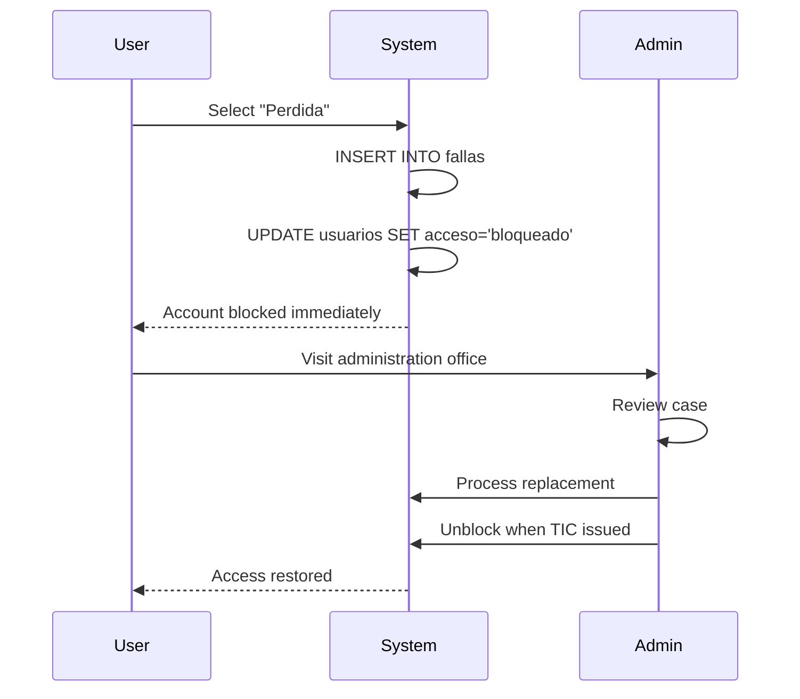

# Reporting TIC Issues

This guide explains how to properly report issues with your TIC (Tarjeta de Identificación Cooperativista).

## Types of TIC Issues

<CardGroup cols={3}>
  <Card title="Lost Card" icon="magnifying-glass">
    Cannot find your TIC anywhere
  </Card>
  <Card title="Stolen Card" icon="user-secret">
    TIC was stolen or taken
  </Card>
  <Card title="Damaged Card" icon="triangle-exclamation">
    TIC is physically damaged
  </Card>
</CardGroup>

## Reporting Process

<Tabs>
  <Tab title="Lost TIC">
    <Steps>
      <Step title="Try to Locate First">
        **Before reporting as lost**:
        - Check all bags, pockets, jackets
        - Look at home, car, last locations
        - Check with lost & found office
        - Ask family/roommates
        
        **Wait 24 hours** if you think you just misplaced it.
      </Step>

      <Step title="Report in System">
        If truly lost:
        1. Go to campus entrance
        2. Enter your ID
        3. Select **"Perdida"** (Lost)
        4. System immediately blocks your account
      </Step>

      <Step title="Visit Administration">
        **Same day if possible**:
        - Go to Dirección office
        - Bring your cédula (government ID)
        - Fill out lost card form
        - Request replacement TIC
      </Step>

      <Step title="Pay Replacement Fee">
        **If applicable**:
        - Fee amount: Check with admin
        - Payment methods: Cash, card, or payroll deduction
        - Receipt required
      </Step>

      <Step title="Receive New TIC">
        **Timeline**:
        - Photo taken (if needed)
        - New card printed: 1-3 business days
        - Pickup at administration
        - Account unblocked when you receive new TIC
      </Step>
    </Steps>

    <Warning>
      Reporting a card as "Perdida" **immediately blocks** your account for security. Do not use this option if you just forgot your card at home.
    </Warning>
  </Tab>

  <Tab title="Stolen TIC">
    <Steps>
      <Step title="Report to Security Immediately">
        **If TIC was stolen on campus**:
        1. Report to campus security immediately
        2. File incident report
        3. Get report number
        
        **If stolen off-campus**:
        1. Consider filing police report
        2. Proceed to report in system
      </Step>

      <Step title="Block in System">
        1. Go to any campus entrance
        2. Enter your ID
        3. Select **"Perdida"**
        4. Inform security it was stolen (they'll note it)
      </Step>

      <Step title="Visit Administration">
        - Bring police/security report (if available)
        - Explain circumstances
        - Request emergency replacement
      </Step>

      <Step title="Expedited Replacement">
        Stolen card cases may receive:
        - Priority processing
        - Waived or reduced fee
        - Temporary access badge while waiting
      </Step>
    </Steps>

    <Note>
      Stolen cards are treated as **security incidents**. The old card will be permanently deactivated in all systems.
    </Note>
  </Tab>

  <Tab title="Damaged TIC">
    <Steps>
      <Step title="Assess Damage">
        **Minor damage** (still readable):
        - Scratches, slight bending
        - Faded printing but QR code works
        - Worn edges
        
        → Can continue using, schedule replacement

        **Major damage** (unusable):
        - Broken/cracked
        - Unreadable magnetic strip/QR code
        - Torn or missing pieces
        
        → Immediate replacement needed
      </Step>

      <Step title="Visit Administration">
        **Bring**:
        - Damaged TIC card (if you have pieces)
        - Your cédula
        - Explanation of how damage occurred
      </Step>

      <Step title="Replacement Decision">
        **Admin will determine**:
        - If damage was due to normal wear → Free replacement
        - If damage was due to negligence → Replacement fee
        - Emergency issuance if needed
      </Step>

      <Step title="Receive Replacement">
        - Usually same-day or next-day
        - Old card surrendered (if available)
        - New card activated immediately
      </Step>
    </Steps>
  </Tab>
</Tabs>

## What Happens When You Report "Perdida"

## Temporary Access Solutions

While waiting for replacement TIC:

<AccordionGroup>
  <Accordion title="Temporary Badge">
    **What It Is**: Paper or plastic temporary ID

    **How to Get**:
    - Request from administration
    - Valid for: 1-5 days typically
    - Requires: Photo, cédula, reason

    **Limitations**:
    - May not work in all card readers
    - Requires manual verification by security
    - Cannot be used for library, gym, etc.
  </Accordion>

  <Accordion title="Manual Entry Log">
    **What It Is**: Security manually logs your entry

    **Process**:
    - Present cédula at entrance
    - Security verifies identity
    - Name logged in manual entry book
    - Allowed to enter

    **When Used**:
    - Emergency situations
    - After-hours entry
    - Multiple-day wait for replacement
  </Accordion>

  <Accordion title="Emergency Contact Access">
    **For Critical Cases**:
    - Employees with urgent work needs
    - Students with exams/presentations
    - Contractors with deadlines

    **Approval**:
    - Supervisor/professor provides authorization
    - Administration issues emergency 1-day pass
    - Must return next day
  </Accordion>
</AccordionGroup>

## Prevention Tips

<CardGroup cols={2}>
  <Card title="Use Card Holder" icon="wallet">
    Keep TIC in:
    - Dedicated cardholder
    - Lanyard with ID sleeve
    - Badge reel clip
  </Card>

  <Card title="Avoid Damage" icon="shield">
    Protect from:
    - Water/liquids
    - Extreme heat/cold
    - Bending/pressure
    - Magnetic fields
  </Card>

  <Card title="Regular Checks" icon="eye">
    Verify you have TIC:
    - Before leaving home
    - Before bed (put in bag)
    - After using at campus
  </Card>

  <Card title="Backup Info" icon="floppy-disk">
    Save in phone:
    - Institutional ID number
    - Administration phone
    - Emergency contact
  </Card>
</CardGroup>

## Replacement Fees

<Note>
  Replacement fee policies vary. Check with your campus administration for current rates.
</Note>

**Typical Fee Structure**:
- **First replacement**: Free (if lost/damaged)
- **Second replacement** (same semester): Partial fee
- **Third+ replacement**: Full fee
- **Stolen** (with police report): Fee waived
- **Normal wear**: Free replacement

## FAQ

<AccordionGroup>
  <Accordion title="I found my TIC after reporting it lost. What now?">
    **Do NOT use the old card**:
    1. It has been deactivated in the system
    2. Using it may trigger security alerts
    3. Bring it to administration
    4. They will destroy it properly
    5. Continue using your new TIC
  </Accordion>

  <Accordion title="How long does replacement take?">
    **Timeline**:
    - Same-day: If emergency and supplies available
    - 1-3 business days: Normal processing
    - Up to 1 week: During peak periods (start of semester)

    **Expedited service** available for:
    - Stolen cards
    - Employee critical access
    - Student exam periods
  </Accordion>

  <Accordion title="Can I use someone else's TIC?">
    **Absolutely NOT**:
    - Violates university policy
    - Security risk
    - Can result in:
      - Both accounts blocked
      - Disciplinary action
      - Possible expulsion/termination

    **Always use only your own TIC.**
  </Accordion>

  <Accordion title="What if I lose my TIC multiple times?">
    **Consequences**:
    - Increasing replacement fees
    - Mandatory meeting with supervisor/advisor
    - Potential requirement for:
      - Lanyard use
      - Daily check-ins
      - Card deposit

    **After 3 losses in one semester**:
    - Investigation for negligence
    - Possible restrictions on card replacement
  </Accordion>
</AccordionGroup>

## Contact Information

**Administration Office**:
- **Location**: [Building/Room Number]
- **Hours**: Monday-Friday, 8:00 AM - 5:00 PM
- **Phone**: [Phone Number]
- **Email**: [Email Address]

**Emergency After Hours**:
- **Security Office**: [Phone Number]
- **Available**: 24/7 for urgent cases

## Next Steps

<CardGroup cols={2}>
  <Card title="Student Flow" href="/user-guide/student-flow">
    Back to student workflow
  </Card>
  <Card title="Blocking System" href="/features/blocking-system">
    Understand blocking rules
  </Card>
  <Card title="Admin Contact" href="/admin/overview">
    Contact administration
  </Card>
</CardGroup>
