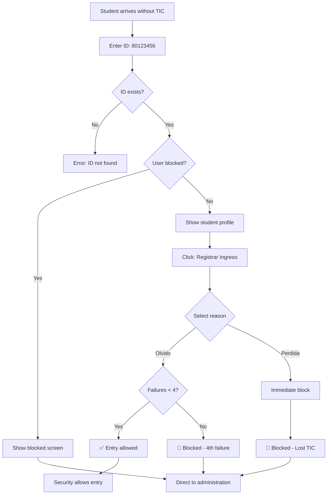

# Student User Flow

This guide walks through the complete process for **students** who arrive at campus without their physical TIC (Tarjeta de Identificación Cooperativista).

## Prerequisites

<CardGroup cols={2}>
  <Card title="Enrollment" icon="graduation-cap">
    Student must be enrolled in an academic program
  </Card>
  <Card title="Registration" icon="database">
    Student data must exist in system database
  </Card>
  <Card title="Active Status" icon="circle-check">
    Student must not be blocked
  </Card>
  <Card title="Physical Presence" icon="building">
    Student must be at campus entrance
  </Card>
</CardGroup>

## Complete Flow

<Steps>
  <Step title="Arrive at Campus Entrance">
    Student arrives at UCC campus entrance without their physical TIC card.

    **Security Guard Actions**:
    - Greet student
    - Ask why they don't have their TIC
    - Direct them to the access control kiosk/terminal
  </Step>

  <Step title="Enter Institutional ID">
    Student (or security guard) enters their institutional ID number.

    **ID Format**: Typically 8 digits starting with "80" (e.g., 80123456)

    ```
    [         80123456         ]
    [      INGRESAR      ]
    ```

    <Tip>
      Students can find their ID number on:
      - Student portal
      - Email communications from UCC
      - Previous semester documents
      - Official university correspondence
    </Tip>
  </Step>

  <Step title="System Validates ID">
    The system queries the database:

    ```sql
    SELECT 
        u.*,
        ie.programa,
        r.nombre_rol
    FROM usuarios u
    JOIN info_estudiante ie ON u.id_institucional = ie.id_institucional
    JOIN usuario_roles ur ON u.id_institucional = ur.id_institucional
    JOIN roles r ON ur.rol_id = r.id
    WHERE u.id_institucional = '80123456';
    ```

    **Possible Outcomes**:
    - ✅ ID found, user active → Continue
    - ❌ ID not found → Display error
    - ⛔ ID found, user blocked → Show blocked screen
  </Step>

  <Step title="View Student Profile">
    System displays student information:

    ```
    ┌─────────────────────────────────────┐
    │  📚 Juan Pérez Gómez               │
    │  ID: 80123456 | CC: 1234567890     │
    ├─────────────────────────────────────┤
    │  ESTUDIANTE                         │
    │  • Ingeniería de Sistemas            │
    │                                     │
    │  ⚠️ Fallas: 2/4                     │
    └─────────────────────────────────────┘
    
    [  REGISTRAR INGRESO SIN CARNET  ]
    ```

    **Information Shown**:
    - Full name
    - Institutional ID and document ID
    - Role badge (ESTUDIANTE)
    - Academic program
    - Current failure count
  </Step>

  <Step title="Select Reason for Missing TIC">
    Student clicks "Registrar Ingreso Sin Carnet" and selects reason:

    <Tabs>
      <Tab title="Olvido (Forgot)">
        **Icon**: 🤦‍♂️
        
        **Description**: "Olvidé mi carnet en casa"

        **System Action**:
        - Increment failure counter
        - Check if total < 4
        - Allow entry with warning

        **When to Use**:
        - Forgot card at home
        - Left in another bag/jacket
        - Temporary forgetfulness
      </Tab>

      <Tab title="Perdida (Lost)">
        **Icon**: 😰
        
        **Description**: "Perdí mi carnet"

        **System Action**:
        - Record lost card
        - **Immediate blocking**
        - Direct to administration

        **When to Use**:
        - Card is genuinely lost
        - Cannot find card anywhere
        - Last saw it days ago

        <Warning>
          Selecting "Perdida" will **immediately block** your account. Only use if card is truly lost.
        </Warning>
      </Tab>
    </Tabs>
  </Step>

  <Step title="System Processes Entry">
    <Tabs>
      <Tab title="Olvido - Entry Allowed">
        If failures < 4:

        ```sql
        -- Insert failure record
        INSERT INTO fallas (id_institucional, motivo)
        VALUES ('80123456', 'olvido');
        
        -- Trigger updates:
        UPDATE usuarios 
        SET total_fallas = total_fallas + 1
        WHERE id_institucional = '80123456';
        ```

        **Screen Shows**:
        ```
        ✅ INGRESO PERMITIDO
        
        Fallas acumuladas: 3/4
        
        ⚠️ ADVERTENCIA:
        Tienes 3 fallas registradas.
        Una falla más causará el BLOQUEO automático.
        Recuerda traer tu TIC.
        
        [ CERRAR ]
        ```
      </Tab>

      <Tab title="Olvido - 4th Failure (Blocked)">
        If this is the 4th failure:

        ```sql
        -- Insert 4th failure
        INSERT INTO fallas (id_institucional, motivo)
        VALUES ('80123456', 'olvido');
        
        -- Trigger blocks user:
        UPDATE usuarios 
        SET total_fallas = 4,
            acceso = 'bloqueado'
        WHERE id_institucional = '80123456';
        ```

        **Screen Shows**:
        ```
        🚫 USUARIO BLOQUEADO
        
        Has acumulado 4 fallas por olvido.
        
        QUÉ HACER:
        1. Dirígete a la Dirección
        2. Presenta tu cédula
        3. Solicita el desbloqueo
        
        [ VOLVER AL INICIO ]
        ```
      </Tab>

      <Tab title="Perdida - Immediate Block">
        ```sql
        -- Insert lost card record
        INSERT INTO fallas (id_institucional, motivo)
        VALUES ('80123456', 'perdida');
        
        -- Immediate block (regardless of count):
        UPDATE usuarios 
        SET acceso = 'bloqueado'
        WHERE id_institucional = '80123456';
        ```

        **Screen Shows**:
        ```
        🚫 TIC REPORTADA COMO PERDIDA
        
        Tu cuenta ha sido bloqueada por seguridad.
        
        QUÉ HACER:
        1. Dirígete a la Dirección
        2. Presenta tu cédula
        3. Solicita reposición de TIC
        4. Espera desbloqueo
        
        [ VOLVER AL INICIO ]
        ```
      </Tab>
    </Tabs>
  </Step>

  <Step title="Security Guard Action">
    Based on system response:

    **If Entry Allowed**:
    - ✅ Allow student to enter campus
    - Remind them to bring TIC next time
    - Note failure count if close to limit

    **If Blocked**:
    - ❌ Deny entry
    - Direct student to administration office
    - Provide directions if needed
  </Step>
</Steps>

## Visual Flow Diagram



## Student Responsibilities

<AccordionGroup>
  <Accordion title="Always Bring Your TIC">
    **Primary Responsibility**: Carry your physical TIC card daily.

    **Why It Matters**:
    - Normal entry is faster
    - Avoids failure accumulation
    - Prevents potential blocking
    - Maintains good standing

    **Tips**:
    - Keep TIC in wallet/card holder
    - Check bag before leaving home
    - Set reminder on phone
    - Have backup location (locker)
  </Accordion>

  <Accordion title="Know Your Institutional ID">
    **Requirement**: Memorize your 8-digit ID number.

    **Where to Find It**:
    - Student portal header
    - Email signature from UCC
    - Course registration documents
    - Library card
    - Physical TIC card itself

    **Pro Tip**: Save it in your phone's notes app.
  </Accordion>

  <Accordion title="Report Lost Cards Immediately">
    **If TIC is Lost**:
    1. Report it in the system (select "Perdida")
    2. Visit administration same day if possible
    3. Request replacement TIC
    4. Pay replacement fee (if applicable)

    **Don't**:
    - Select "Olvido" if card is truly lost
    - Wait days to report
    - Use someone else's card
  </Accordion>

  <Accordion title="Understand the 4-Strike Rule">
    **Rule**: 3 "olvido" incidents allowed, 4th causes block.

    **Progression**:
    - 1st time: Entry allowed, minor warning
    - 2nd time: Entry allowed, caution advised
    - 3rd time: Entry allowed, **strong warning**
    - 4th time: **BLOCKED**, must visit admin

    **Reset**: Counter resets each semester.
  </Accordion>
</AccordionGroup>

## Common Scenarios

<Tabs>
  <Tab title="First Time Forgetting">
    **Situation**: This is your first time forgetting your TIC this semester.

    **Process**:
    1. Enter ID: 80123456
    2. Profile shows: "Fallas: 0/4"
    3. Select: "Olvido"
    4. Result: "✅ Ingreso Permitido - Fallas: 1/4"
    5. Enter campus

    **Outcome**: No issues, but reminder to bring TIC next time.
  </Tab>

  <Tab title="Third Time (Warning)">
    **Situation**: This is your 3rd forgotten TIC.

    **Process**:
    1. Enter ID: 80123456
    2. Profile shows: "Fallas: 2/4"
    3. Select: "Olvido"
    4. Result: "⚠️ ADVERTENCIA - Fallas: 3/4 - Siguiente falla causará bloqueo"
    5. Enter campus (but note the serious warning)

    **Action Required**: 
    - Be extra careful to bring TIC from now on
    - Consider setting daily reminders
    - One more incident = blocked
  </Tab>

  <Tab title="Fourth Time (Blocked)">
    **Situation**: This is your 4th forgotten TIC.

    **Process**:
    1. Enter ID: 80123456
    2. Profile shows: "Fallas: 3/4"
    3. Select: "Olvido"
    4. Result: "🚫 BLOQUEADO - 4 fallas acumuladas"
    5. Cannot enter campus

    **Next Steps**:
    1. Go to Dirección (administration office)
    2. Bring your cédula (ID document)
    3. Explain situation to admin
    4. Wait for unblock (usually same day)
    5. Commit to bringing TIC daily
  </Tab>

  <Tab title="Lost TIC Card">
    **Situation**: You genuinely lost your TIC card.

    **Process**:
    1. Enter ID: 80123456
    2. Select: "Perdida"
    3. Result: "🚫 BLOQUEADO INMEDIATAMENTE"
    4. Cannot enter campus

    **Next Steps**:
    1. Go to Dirección immediately
    2. Report lost TIC
    3. Request replacement card
    4. Pay fee (if required)
    5. Wait for unblock after new TIC issued
  </Tab>
</Tabs>

## What Happens After Blocking?

<Steps>
  <Step title="Visit Administration">
    Go to the Dirección office during business hours.
    
    **Bring**:
    - Cédula (government ID)
    - Student ID number (80XXXXXX)
    - Explanation of situation
  </Step>

  <Step title="Admin Review">
    Administrator will:
    - Look up your record
    - Review failure history
    - Ask about circumstances
    - Determine if unblock is appropriate
  </Step>

  <Step title="Unblock Decision">
    **If Approved**:
    - Admin enters justification
    - System unblocks account
    - Failure counter resets to 0/4
    - You can enter campus immediately

    **If Denied** (rare):
    - Admin explains reason
    - May require meeting with supervisor
    - Alternative arrangements discussed
  </Step>

  <Step title="Fresh Start">
    After unblock:
    - You have 0/4 failures again
    - Normal campus access restored
    - Commit to bringing TIC daily
  </Step>
</Steps>

## Tips for Students

<CardGroup cols={2}>
  <Card title="Routine Check" icon="clipboard-check">
    Before leaving home:
    - Phone? ✓
    - Wallet? ✓
    - Keys? ✓
    - **TIC?** ✓
  </Card>
  
  <Card title="Backup Location" icon="box">
    Keep TIC in:
    - Dedicated card holder
    - Always-used backpack
    - Wallet (not jacket pocket)
  </Card>
  
  <Card title="Phone Reminder" icon="bell">
    Set daily alarm:
    - "Remember TIC!"
    - 30 minutes before leaving
    - Every school day
  </Card>
  
  <Card title="Visual Cue" icon="eye">
    Place TIC:
    - On top of phone at night
    - Next to door keys
    - In bag night before
  </Card>
</CardGroup>

## FAQ

<AccordionGroup>
  <Accordion title="What if I forget my ID number?">
    **Solutions**:
    1. Check your student email signature
    2. Login to student portal (shows on dashboard)
    3. Ask security to look up by name and cédula
    4. Call student services

    **Pro Tip**: Save your ID in your phone's contacts under "My UCC ID".
  </Accordion>

  <Accordion title="Does the counter ever reset?">
    **Yes**:
    - Resets to 0 at start of each semester
    - Resets to 0 when admin unblocks you

    **No**:
    - Does NOT reset automatically mid-semester
    - Does NOT reset just by waiting
  </Accordion>

  <Accordion title="Can I contest a failure?">
    **Yes**, if recorded incorrectly:
    1. Visit administration immediately
    2. Explain the error
    3. Admin can delete incorrect record
    4. Counter recalculates automatically

    **Note**: "I didn't mean to click Olvido" is not a valid contest.
  </Accordion>

  <Accordion title="What if I'm both student and employee?">
    **You have multiple roles**, but:
    - Failure counter applies to **your account** (not per role)
    - Blocking affects **all your roles**
    - You cannot use "employee" access if blocked as "student"

    See [Multi-Role System](/features/multi-role-system) for details.
  </Accordion>
</AccordionGroup>

## Next Steps

<CardGroup cols={2}>
  <Card title="Employee Flow" icon="briefcase" href="/user-guide/employee-flow">
    If you're also an employee
  </Card>
  <Card title="Reporting TIC Issues" icon="id-card" href="/user-guide/reporting-tic">
    How to report lost/stolen TIC
  </Card>
  <Card title="Failure Tracking" icon="triangle-exclamation" href="/features/failure-tracking">
    Understand the failure system
  </Card>
  <Card title="Blocking System" icon="ban" href="/features/blocking-system">
    Learn about automatic blocking
  </Card>
</CardGroup>
